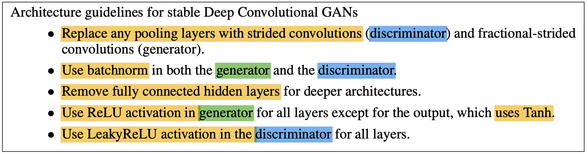

## AI自动化测试大作业报告

#### 《报告人信息》

**学号-姓名** ：155250001 宋吉载

**选题方向**：AI自动化测试大作业

***

#### 《开发环境》

测试数据生成 : Pytorch 1.7.0

测试数据评估：TensorFlow 1.14.0; Keras 2.2.4

***

#### 《运行命令》

1️⃣ https://drive.google.com/drive/folders/1dDTPLrMk9qHQpSg1ejryDXh-zqSzv2Av?usp=sharing

2️⃣ 点击run.ipynb (Colab)

3️⃣ 训练DCGAN的命令 ：

```colab
!python3 "/content/drive/MyDrive/Final-Project/main.py"  \
--mode "train" \
--data_dir "/content/drive/MyDrive/Final-Project/CIFAR100/CIFAR100_FULL_JPG" \
--ckpt_dir "/content/drive/MyDrive/Final-Project/checkpoint_CIFAR100" \
--log_dir "/content/drive/MyDrive/Final-Project/log_CIFAR100" \
--result_dir "/content/drive/MyDrive/Final-Project/result_CIFAR100"
```

4️⃣ 生成测试数据的命令：

```colab
!python3 "/content/drive/MyDrive/Final-Project/main.py"  \
--mode "test" \
--data_dir "/content/drive/MyDrive/Final-Project/CIFAR100/CIFAR100_FULL_JPG" \
--ckpt_dir "/content/drive/MyDrive/Final-Project/checkpoint_CIFAR100" \
--log_dir "/content/drive/MyDrive/Final-Project/log_CIFAR100" \
--result_dir "/content/drive/MyDrive/Final-Project/result_CIFAR100"
```

5️⃣ 训练中间结果可视化(png)的位置 ：/drive/MyDrive/Final-Project/result_CIFAR100/train/png

6️⃣ 生成测试数据(png)的位置 ：/drive/MyDrive/Final-Project/result_CIFAR100/test/png

***

#### 《测试数据生成方法介绍》

##### ☑️ 参考文献 ：

1. Generative Adversarial Networks ：	

   https://arxiv.org/abs/1406.2661

2. Unsupervised Representation Learning with Deep Convolutional Generative Adversarial Networks：

   https://arxiv.org/abs/1511.06434

   

##### ☑️ 实现原理：

👉 为了实现Deep Convolutional Generative Adversarial Networks(DCGAN)，需要生成两个网络(一个生成器网络和一个判别器网络)。

👉 尽量基于文献提出的Guidelines来实现了生成器和判别器：



👉 网络介绍：

1. 生成器（Generator）：Input : (100, 1, 1) ➡️ Output : (3, 64, 64);


* 在最后层，没使用了Normalization和ReLU，而使用了Tanh

```python
<model.py>
class DCGAN(nn.Module):
    def __init__(self, in_channels, out_channels, nker=64, norm="bnorm"):
        super(DCGAN, self).__init__()

        self.dec1 = DECBR2d(1 * in_channels, 8 * nker, kernel_size=4, stride=1,
                            padding=0, norm=norm, relu=0.0, bias=False)

        self.dec2 = DECBR2d(8 * nker, 4 * nker, kernel_size=4, stride=2,
                            padding=1, norm=norm, relu=0.0, bias=False)

        self.dec3 = DECBR2d(4 * nker, 2 * nker, kernel_size=4, stride=2,
                            padding=1, norm=norm, relu=0.0, bias=False)

        self.dec4 = DECBR2d(2 * nker, 1 * nker, kernel_size=4, stride=2,
                            padding=1, norm=norm, relu=0.0, bias=False)

        self.dec5 = DECBR2d(1 * nker, out_channels, kernel_size=4, stride=2,
                            padding=1, norm=None, relu=None, bias=False)

    def forward(self, x):

        x = self.dec1(x)
        x = self.dec2(x)
        x = self.dec3(x)
        x = self.dec4(x)
        x = self.dec5(x)

        x = torch.tanh(x)

        return x
```


2. 判别器（Discriminator）: Input : (3, 64, 64) ➡️ Output : (1, 1, 1);

* Discriminator具有跟Generator相反的架构

* 每层使用了LeakyReLU :

  

* 在最后层，没使用了Normalization和ReLU，而使用了Sigmoid

  

```python
<model.py>
class Discriminator(nn.Module):
    def __init__(self, in_channels, out_channels, nker=64, norm="bnorm"):
        super(Discriminator, self).__init__()

        self.enc1 = CBR2d(1 * in_channels, 1 * nker, kernel_size=4, stride=2,
                          padding=1, norm=norm, relu=0.2, bias=False)

        self.enc2 = CBR2d(1 * nker, 2 * nker, kernel_size=4, stride=2,
                          padding=1, norm=norm, relu=0.2, bias=False)

        self.enc3 = CBR2d(2 * nker, 4 * nker, kernel_size=4, stride=2,
                          padding=1, norm=norm, relu=0.2, bias=False)

        self.enc4 = CBR2d(4 * nker, 8 * nker, kernel_size=4, stride=2,
                          padding=1, norm=norm, relu=0.2, bias=False)

        self.enc5 = CBR2d(8 * nker, out_channels, kernel_size=4, stride=2,
                          padding=1, norm=None, relu=None, bias=False)

    def forward(self, x):

        x = self.enc1(x)
        x = self.enc2(x)
        x = self.enc3(x)
        x = self.enc4(x)
        x = self.enc5(x)

        x = torch.sigmoid(x)

        return x
```

* Discriminator的输出值 ：

  |  输出值范围   |                             意思                             |
  | :-----------: | :----------------------------------------------------------: |
  | 输出值 >= 0.5 |                   输入的图像数据是‘真’数据                   |
  | 输出值 < 0.5  | 输入的图像数据是‘假’数据 （也表示通过Generator来生成的数据） |


👉 训练网络的详细部分：

* 初始化生成器网络和判别器网络里所有Weight：正态分布(平均值 = 0, 标准差=0.02)

  

  ```python
  <util.py>
  def init_weights(net, init_type='normal', init_gain=0.02):
  
      def init_func(m): 
          classname = m.__class__.__name__
          if hasattr(m, 'weight') and 
          (classname.find('Conv') != -1 or classname.find('Linear') != -1):
              if init_type == 'normal':
                  nn.init.normal_(m.weight.data, 0.0, init_gain)
                  
              if hasattr(m, 'bias') and m.bias is not None:
                  nn.init.constant_(m.bias.data, 0.0)
          elif classname.find('BatchNorm2d') != -1:  
              nn.init.normal_(m.weight.data, 1.0, init_gain)
              nn.init.constant_(m.bias.data, 0.0)
  
      print('initialize network with %s' % init_type)
      net.apply(init_func)  
  ```

* loss 函数 ： BinaryCrossEntropy Loss

  ```python
  <train.py>
  fn_loss = nn.BCELoss().to(device)
  ```

* 两个Optimizer（一个生成器网络的和一个判别器网络的） ：

  为了稳定的训练，设置了momentum term值为0.5

  

  ```python
  <train.py>
  optimG = torch.optim.Adam(netG.parameters(), lr=lr, betas=(0.5, 0.999))
  optimD = torch.optim.Adam(netD.parameters(), lr=lr, betas=(0.5, 0.999))
  ```


***

#### 《测试数据质量度量方法介绍》

☑️ MNIST 模型测试

⚠️由于无法加载hdf5文件的模型，只测试了random1_mnist和random2_mnist模型

【1】  random1_mnist ： 该模型把所有的生成的测试数据预测为‘8’

| 预测为‘8’                                                    |
| ------------------------------------------------------------ |
|  |

【2】  random2_mnist ： 没有预测为‘7’的测试数据，该模型偏向于预测为‘0’，‘3’，‘8’

| 预测为‘0’                                                    | 预测为‘1’                                                    | 预测为‘2’                                                    |
| ------------------------------------------------------------ | ------------------------------------------------------------ | ------------------------------------------------------------ |
|  |  |  |

| 预测为‘3’                                                    | 预测为‘4’                                                    | 预测为‘5’                                                    |
| ------------------------------------------------------------ | ------------------------------------------------------------ | ------------------------------------------------------------ |
|  |  |  |

| 预测为‘6’                                                    | 预测为‘8’                                                    | 预测为‘9’                                                    |
| ------------------------------------------------------------ | ------------------------------------------------------------ | ------------------------------------------------------------ |
|  |  |  |


☑️ CIFAR100 模型测试

【1】 CNN_with_dropout：

|                       源数据（train）                        |                        生成的测试数据                        |
| :----------------------------------------------------------: | :----------------------------------------------------------: |
|  |  |

【2】 CNN_without_dropout：

|                       源数据（train）                        |                        生成的测试数据                        |
| :----------------------------------------------------------: | :----------------------------------------------------------: |
|  |  |

【3】 lenet5_with_dropout：

|                       源数据（train）                        |                        生成的测试数据                        |
| :----------------------------------------------------------: | :----------------------------------------------------------: |
|  |  |

【4】 lenet5_without_dropout：

|                       源数据（train）                        |                        生成的测试数据                        |
| :----------------------------------------------------------: | :----------------------------------------------------------: |
|  |  |

【5】 random1：

|                       源数据（train）                        |                        生成的测试数据                        |
| :----------------------------------------------------------: | :----------------------------------------------------------: |
|  |  |

【6】 random2：

|                       源数据（train）                        |                        生成的测试数据                        |
| :----------------------------------------------------------: | :----------------------------------------------------------: |
|  |  |

【7】 ResNet_v1：

|                       源数据（train）                        |                        生成的测试数据                        |
| :----------------------------------------------------------: | :----------------------------------------------------------: |
|  |  |

【8】 ResNet_v2：

|                       源数据（train）                        |                        生成的测试数据                        |
| :----------------------------------------------------------: | :----------------------------------------------------------: |
|  |  |

